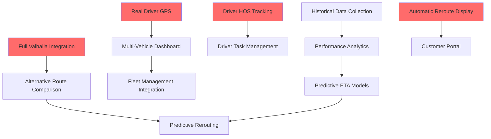
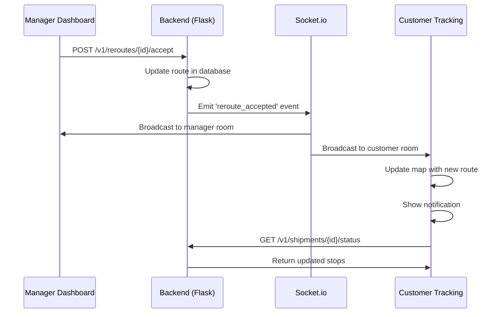
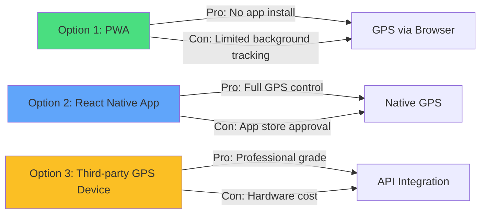
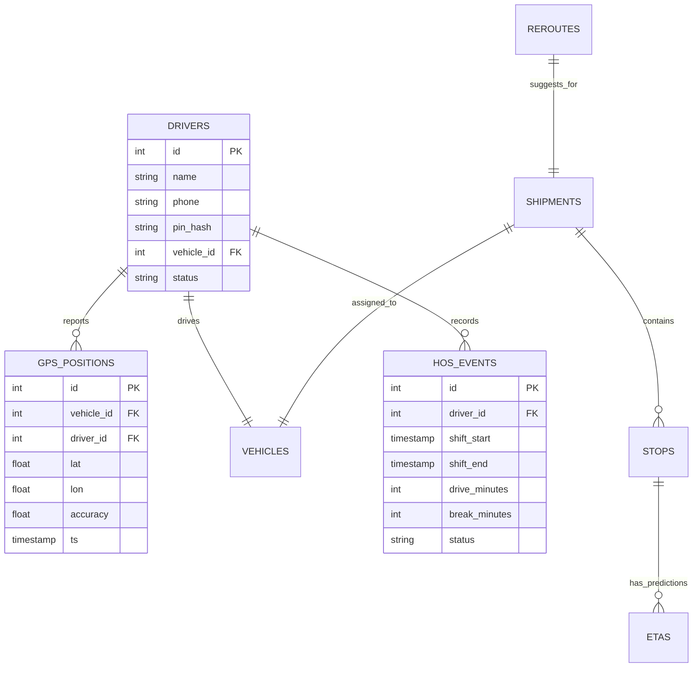
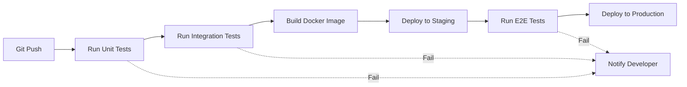

# 🛠️ Implementation Guide - ETA Tracker

Comprehensive technical guide for implementing all remaining features in priority order.

**Version**: 1.1.0  
**Last Updated**: November 4, 2025  
**Target Audience**: Developers, Technical Leads, Project Managers

---

## 📑 Table of Contents

1. [Implementation Priorities](#implementation-priorities)
2. [Phase 1: MVP Completion (Critical Features)](#phase-1-mvp-completion-critical-features)
3. [Phase 2: Enhanced UX](#phase-2-enhanced-ux)
4. [Phase 3: Advanced Analytics](#phase-3-advanced-analytics)
5. [Phase 4: Enterprise Features](#phase-4-enterprise-features)
6. [Technical Architecture Changes](#technical-architecture-changes)
7. [Testing Strategy](#testing-strategy)
8. [Deployment Plan](#deployment-plan)

---

## 🎯 Implementation Priorities

### Priority Matrix

| Phase | Features | Estimated Time | Impact | Complexity |
|-------|----------|----------------|--------|------------|
| **Phase 1** | MVP Completion | 6-8 weeks | 🔥 Critical | Medium |
| **Phase 2** | Enhanced UX | 4-6 weeks | ⚡ High | Medium |
| **Phase 3** | Advanced Analytics | 8-10 weeks | 📊 High | High |
| **Phase 4** | Enterprise Features | 12-16 weeks | 🚀 Medium | High |

### Dependency Chain



---

## 🚀 Phase 1: MVP Completion (Critical Features)

**Timeline**: 6-8 weeks  
**Goal**: Complete core functionality for production readiness

---

### 1.1 Full Valhalla Routing Engine Integration

**Priority**: 🔥 CRITICAL  
**Estimated Time**: 2 weeks  
**Dependencies**: None

#### Current State
- Using OSRM as routing backend
- `valhalla_url` is None
- Placeholder methods exist in `backend/valhalla_client.py`

#### What Needs to Be Implemented

##### Backend Changes

**File**: `backend/valhalla_client.py`

1. **Set up Valhalla Server** (Week 1, Days 1-2)

```bash
# Docker deployment
docker run -d -p 8002:8002 \
  --name valhalla \
  -v $(pwd)/valhalla_data:/data \
  valhalla/valhalla:latest
```

Environment variable in `.env`:
```bash
VALHALLA_URL=http://localhost:8002
```

2. **Implement `_valhalla_route()` Method** (Week 1, Days 3-5)

**Location**: Line 117-150

```python
def _valhalla_route(self, waypoints: List[Tuple[float, float]],
                   constraints: VehicleConstraints, costing: str) -> Dict:
    """Route using Valhalla with truck costing"""
    try:
        locations = [{"lat": lat, "lon": lon} for lat, lon in waypoints]
        
        request_body = {
            "locations": locations,
            "costing": costing,
            "costing_options": {
                "truck": {
                    "height": constraints.height_m,
                    "width": constraints.width_m,
                    "weight": constraints.weight_tons,
                    "hazmat": constraints.hazmat_allowed,
                    "use_tolls": 0.0 if constraints.avoid_tolls else 1.0
                }
            },
            "directions_options": {
                "units": "kilometers",
                "language": "en-US"
            },
            "alternates": 3  # Request 3 alternative routes
        }
        
        response = requests.post(
            f"{self.valhalla_url}/route",
            json=request_body,
            timeout=10
        )
        response.raise_for_status()
        
        data = response.json()
        trip = data['trip']
        leg = trip['legs'][0]
        
        # Parse maneuvers into instructions
        instructions = []
        for maneuver in leg['maneuvers']:
            instructions.append({
                'instruction': maneuver.get('instruction', ''),
                'distance_m': maneuver.get('length', 0) * 1000,
                'duration_s': maneuver.get('time', 0)
            })
        
        return {
            'success': True,
            'geometry': leg['shape'],  # Encoded polyline
            'distance_km': trip['summary']['length'],
            'duration_min': trip['summary']['time'] / 60,
            'distance_m': trip['summary']['length'] * 1000,
            'duration_s': trip['summary']['time'],
            'instructions': instructions,
            'waypoints': waypoints,
            'costing': costing,
            'source': 'valhalla',
            'alternatives': self._parse_alternatives(data.get('alternates', []))
        }
        
    except Exception as e:
        return {
            'success': False,
            'error': str(e),
            'source': 'valhalla'
        }

def _parse_alternatives(self, alternates: List[Dict]) -> List[Dict]:
    """Parse alternative routes from Valhalla response"""
    alternatives = []
    for alt in alternates:
        trip = alt['trip']
        alternatives.append({
            'distance_km': trip['summary']['length'],
            'duration_min': trip['summary']['time'] / 60,
            'geometry': trip['legs'][0]['shape']
        })
    return alternatives
```

3. **Update Router Initialization** (Week 1, Day 5)

**File**: `backend/app.py`, Line 43

```python
# Replace:
router = get_router()

# With:
valhalla_url = os.getenv('VALHALLA_URL', None)
router = get_router(valhalla_url=valhalla_url)
```

**File**: `backend/valhalla_client.py`, add function:

```python
def get_router(valhalla_url: str = None):
    """Get routing client with Valhalla or OSRM fallback"""
    if valhalla_url:
        return ValhallaRouter(valhalla_url=valhalla_url)
    else:
        return ValhallaRouter()  # Uses OSRM fallback
```

4. **Add Alternative Routes Support** (Week 2, Days 1-3)

**New Method**: `calculate_alternatives()`

```python
def calculate_alternatives(self, waypoints: List[Tuple[float, float]], 
                          constraints: VehicleConstraints = None,
                          num_alternatives: int = 3) -> List[Dict]:
    """
    Calculate multiple alternative routes
    
    Returns:
        List of route options with distance, duration, and reasoning
    """
    if not constraints:
        constraints = VehicleConstraints()
    
    # Request multiple routes with different preferences
    alternatives = []
    
    # Route 1: Fastest (default)
    route1 = self.route(waypoints, constraints, costing="truck")
    if route1['success']:
        alternatives.append({
            'id': 1,
            'name': 'Fastest Route',
            'route': route1,
            'reason': 'Optimized for minimum travel time'
        })
    
    # Route 2: Shortest distance
    constraints_shortest = VehicleConstraints(
        avoid_tolls=constraints.avoid_tolls
    )
    route2 = self._request_with_preference(waypoints, constraints_shortest, 'shortest')
    if route2['success'] and route2['distance_km'] < route1['distance_km'] * 0.95:
        alternatives.append({
            'id': 2,
            'name': 'Shortest Route',
            'route': route2,
            'reason': f"Saves {route1['distance_km'] - route2['distance_km']:.1f} km"
        })
    
    # Route 3: Avoid tolls
    constraints_no_toll = VehicleConstraints(
        avoid_tolls=True,
        height_m=constraints.height_m,
        width_m=constraints.width_m,
        weight_tons=constraints.weight_tons
    )
    route3 = self.route(waypoints, constraints_no_toll, costing="truck")
    if route3['success'] and not constraints.avoid_tolls:
        time_diff = route3['duration_min'] - route1['duration_min']
        alternatives.append({
            'id': 3,
            'name': 'No Tolls',
            'route': route3,
            'reason': f"Avoids tolls (+{time_diff:.0f} min)"
        })
    
    return alternatives[:num_alternatives]
```

##### Frontend Changes

**No changes needed yet** - this is backend infrastructure. UI changes come in next feature.

##### Testing (Week 2, Days 4-5)

**File**: `test_valhalla_integration.py` (new)

```python
import unittest
from backend.valhalla_client import get_router, VehicleConstraints

class TestValhallaIntegration(unittest.TestCase):
    
    def setUp(self):
        self.router = get_router(valhalla_url="http://localhost:8002")
        self.waypoints = [
            (30.08, -94.126),  # Beaumont DC
            (30.063, -94.134)  # Target
        ]
    
    def test_basic_routing(self):
        result = self.router.route(self.waypoints)
        self.assertTrue(result['success'])
        self.assertEqual(result['source'], 'valhalla')
        self.assertGreater(result['distance_km'], 0)
        self.assertGreater(result['duration_min'], 0)
    
    def test_truck_constraints(self):
        constraints = VehicleConstraints(
            height_m=4.1,
            width_m=2.5,
            weight_tons=15.0
        )
        result = self.router.route(self.waypoints, constraints)
        self.assertTrue(result['success'])
    
    def test_alternative_routes(self):
        alternatives = self.router.calculate_alternatives(self.waypoints)
        self.assertGreater(len(alternatives), 0)
        self.assertLessEqual(len(alternatives), 3)
    
    def test_avoid_tolls(self):
        constraints = VehicleConstraints(avoid_tolls=True)
        result = self.router.route(self.waypoints, constraints)
        self.assertTrue(result['success'])

if __name__ == '__main__':
    unittest.main()
```

##### Success Metrics
- ✅ Valhalla server responds to route requests
- ✅ Truck costing with height/weight constraints works
- ✅ Alternative routes are calculated
- ✅ Response time < 2 seconds for typical routes
- ✅ All existing functionality still works with Valhalla

##### Documentation Updates
- Update README.md with Valhalla setup instructions
- Add VALHALLA_URL to .env.example
- Document Docker deployment

---

### 1.2 Automatic Reroute Display for Customer

**Priority**: 🔥 CRITICAL  
**Estimated Time**: 1 week  
**Dependencies**: None (uses existing reroute backend)

#### Current State
- Backend has `accept_reroute()` endpoint
- RerouteModal exists in manager dashboard
- Customer page doesn't receive reroute updates

#### Architecture



#### Implementation Steps

##### Backend Changes (Days 1-2)

**File**: `backend/app.py`

1. **Enhance `accept_reroute()` endpoint** (Line 840-855)

```python
@app.route('/v1/reroutes/<int:reroute_id>/accept', methods=['POST'])
def accept_reroute(reroute_id):
    """Accept a reroute suggestion and broadcast to all clients"""
    try:
        # Get reroute details before accepting
        with db.conn.cursor() as cur:
            cur.execute("""
                SELECT shipment_id, new_eta_ts, time_saved_min, reason
                FROM reroutes
                WHERE id = %s
            """, (reroute_id,))
            reroute = cur.fetchone()
        
        if not reroute:
            return jsonify({'success': False, 'error': 'Reroute not found'}), 404
        
        shipment_id, new_eta_ts, time_saved_min, reason = reroute
        
        # Accept the reroute
        success = db.accept_reroute(reroute_id)
        
        if success:
            # Get updated route details
            stops = db.get_shipment_stops(shipment_id)
            vehicle_pos = db.get_latest_position(db.get_shipment(shipment_id)['vehicle_id'])
            
            # Recalculate route geometry with new path
            waypoints = [(stop['lat'], stop['lon']) for stop in stops if not stop.get('completed')]
            if vehicle_pos:
                waypoints.insert(0, (vehicle_pos['lat'], vehicle_pos['lon']))
            
            new_route = router.route(waypoints)
            
            # Broadcast reroute to all clients watching this shipment
            socketio.emit('reroute_accepted', {
                'shipment_id': shipment_id,
                'reroute_id': reroute_id,
                'new_eta_ts': new_eta_ts.isoformat() if hasattr(new_eta_ts, 'isoformat') else str(new_eta_ts),
                'time_saved_min': time_saved_min,
                'reason': reason,
                'new_route_geometry': new_route.get('geometry') if new_route['success'] else None,
                'stops': [
                    {
                        'seq': s['seq'],
                        'name': s['name'],
                        'lat': float(s['lat']),
                        'lon': float(s['lon']),
                        'eta_seconds': s.get('eta_seconds', 0)
                    }
                    for s in stops
                ]
            }, room=f"shipment_{shipment_id}")
            
            # Log event
            db.log_event(shipment_id, 'reroute_accepted', {
                'reroute_id': reroute_id,
                'time_saved_min': time_saved_min,
                'reason': reason
            })
            
            return jsonify({
                'success': True,
                'message': 'Reroute accepted and broadcasted',
                'shipment_id': shipment_id
            }), 200
        else:
            return jsonify({'success': False, 'error': 'Failed to accept reroute'}), 500
            
    except Exception as e:
        import traceback
        traceback.print_exc()
        return jsonify({'success': False, 'error': str(e)}), 500
```

##### Frontend Changes - Customer Tracking (Days 3-5)

**File**: `pages/TrackingPage.tsx`

1. **Add Socket.io listener for reroute events** (Around line 50)

```typescript
// Add to existing useEffect with socket initialization
useEffect(() => {
    const socket = io(API_URL);
    socketRef.current = socket;

    socket.on('connect', () => {
        console.log('Connected to tracking server');
        if (trackingNumber) {
            socket.emit('subscribe', { shipment_id: shipmentId });
        }
    });

    // Existing listeners...
    
    // NEW: Listen for reroute events
    socket.on('reroute_accepted', (data: {
        shipment_id: number;
        reroute_id: number;
        new_eta_ts: string;
        time_saved_min: number;
        reason: string;
        new_route_geometry: any;
        stops: Stop[];
    }) => {
        console.log('Reroute accepted:', data);
        
        // Update stops with new ETAs
        setStops(data.stops);
        
        // Show notification
        setRerouteNotification({
            visible: true,
            timeSaved: data.time_saved_min,
            reason: data.reason,
            newEta: data.new_eta_ts
        });
        
        // Update route geometry on map
        if (data.new_route_geometry) {
            setRouteGeometry(data.new_route_geometry);
        }
        
        // Auto-hide notification after 10 seconds
        setTimeout(() => {
            setRerouteNotification(prev => ({ ...prev, visible: false }));
        }, 10000);
    });

    return () => {
        socket.disconnect();
    };
}, [trackingNumber, shipmentId]);
```

2. **Add state for reroute notification** (After existing state declarations)

```typescript
const [rerouteNotification, setRerouteNotification] = useState<{
    visible: boolean;
    timeSaved: number;
    reason: string;
    newEta: string;
} | null>(null);

const [routeGeometry, setRouteGeometry] = useState<any>(null);
```

3. **Add Reroute Notification Component** (Before return statement)

```typescript
const RerouteNotification: React.FC<{
    visible: boolean;
    timeSaved: number;
    reason: string;
    newEta: string;
    onClose: () => void;
}> = ({ visible, timeSaved, reason, newEta, onClose }) => {
    if (!visible) return null;
    
    const formattedEta = new Date(newEta).toLocaleTimeString('en-US', {
        hour: 'numeric',
        minute: '2-digit'
    });
    
    return (
        <div className="fixed top-4 left-1/2 transform -translate-x-1/2 z-50 animate-slide-down">
            <div className="bg-gradient-to-r from-green-600 to-green-700 rounded-lg shadow-2xl p-4 max-w-md border border-green-500">
                <div className="flex items-start gap-3">
                    <div className="flex-shrink-0">
                        <svg className="w-6 h-6 text-green-200" fill="none" stroke="currentColor" viewBox="0 0 24 24">
                            <path strokeLinecap="round" strokeLinejoin="round" strokeWidth={2} d="M9 12l2 2 4-4m6 2a9 9 0 11-18 0 9 9 0 0118 0z" />
                        </svg>
                    </div>
                    <div className="flex-1">
                        <h3 className="text-white font-bold text-lg">
                            🚚 Route Updated!
                        </h3>
                        <p className="text-green-100 text-sm mt-1">
                            Your delivery route has been optimized
                        </p>
                        <div className="mt-3 space-y-1">
                            <p className="text-white text-sm">
                                ⏱️ <span className="font-semibold">Saves {timeSaved} minutes</span>
                            </p>
                            <p className="text-green-100 text-xs">
                                {reason}
                            </p>
                            <p className="text-white text-sm mt-2">
                                📍 New ETA: <span className="font-bold">{formattedEta}</span>
                            </p>
                        </div>
                    </div>
                    <button
                        onClick={onClose}
                        className="flex-shrink-0 text-green-200 hover:text-white transition-colors"
                    >
                        <svg className="w-5 h-5" fill="none" stroke="currentColor" viewBox="0 0 24 24">
                            <path strokeLinecap="round" strokeLinejoin="round" strokeWidth={2} d="M6 18L18 6M6 6l12 12" />
                        </svg>
                    </button>
                </div>
            </div>
        </div>
    );
};
```

4. **Add CSS animation** (In the component or global CSS)

```css
@keyframes slide-down {
    from {
        opacity: 0;
        transform: translate(-50%, -20px);
    }
    to {
        opacity: 1;
        transform: translate(-50%, 0);
    }
}

.animate-slide-down {
    animation: slide-down 0.3s ease-out;
}
```

5. **Render notification in JSX** (In the return statement)

```tsx
return (
    <div className="min-h-screen bg-gradient-to-br from-gray-900 via-gray-800 to-gray-900 text-white">
        {/* Reroute Notification */}
        {rerouteNotification && (
            <RerouteNotification
                visible={rerouteNotification.visible}
                timeSaved={rerouteNotification.timeSaved}
                reason={rerouteNotification.reason}
                newEta={rerouteNotification.newEta}
                onClose={() => setRerouteNotification(prev => prev ? { ...prev, visible: false } : null)}
            />
        )}
        
        {/* Rest of existing JSX... */}
    </div>
);
```

6. **Update Map Component to show new route** (Pass routeGeometry as prop)

```tsx
<MapComponent
    vehiclePosition={vehiclePosition}
    stops={stops}
    mode={Mode.Customer}
    newRouteGeometry={routeGeometry}  // NEW PROP
/>
```

##### Frontend Changes - Map Component (Day 5)

**File**: `components/Map.tsx`

Add support for displaying updated route geometry:

```typescript
interface MapProps {
    vehiclePosition: { lat: number; lon: number } | null;
    stops: Stop[];
    mode: Mode;
    shipmentId?: number;
    onRemainingChange?: (info: RemainingInfo | null) => void;
    onTrafficUpdate?: (segments: TrafficSegment[]) => void;
    mapId?: string;
    newRouteGeometry?: any;  // NEW PROP
}

// In useEffect, add handler for new route geometry
useEffect(() => {
    if (!newRouteGeometry || !map.current) return;
    
    // Remove old route
    if (routingControl.current) {
        map.current.removeControl(routingControl.current);
        routingControl.current = null;
    }
    
    // Draw new route with animation
    const newRouteLayer = L.polyline(
        L.PolylineUtil.decode(newRouteGeometry),  // Decode polyline
        {
            color: '#10b981',  // Green for new route
            weight: 4,
            opacity: 0.8,
            className: 'animate-route-update'
        }
    ).addTo(map.current);
    
    // Fit bounds to new route
    map.current.fitBounds(newRouteLayer.getBounds(), { padding: [50, 50] });
    
}, [newRouteGeometry]);
```

##### Testing (Days 6-7)

**Test Scenarios**:

1. **Manager accepts reroute → Customer sees update**
   - Manager dashboard: Trigger reroute suggestion
   - Manager: Accept reroute
   - Customer page: Should show notification within 1 second
   - Customer map: Should update route geometry

2. **Multiple customers tracking same shipment**
   - Open 3 customer tracking tabs
   - Accept reroute in manager dashboard
   - All 3 tabs should show notification simultaneously

3. **Notification auto-dismiss**
   - Wait 10 seconds after reroute
   - Notification should fade out

4. **Customer joins after reroute accepted**
   - Accept reroute
   - Open new customer tracking page
   - Should show current (rerouted) path, no notification

**Test File**: `test_reroute_broadcast.py`

```python
import unittest
from flask_socketio import SocketIOTestClient
from backend.app import app, socketio

class TestRerouteBroadcast(unittest.TestCase):
    
    def setUp(self):
        self.app = app.test_client()
        self.socketio_client = socketio.test_client(app)
    
    def test_reroute_broadcast(self):
        # Subscribe to shipment
        self.socketio_client.emit('subscribe', {'shipment_id': 1})
        
        # Accept reroute
        response = self.app.post('/v1/reroutes/1/accept')
        self.assertEqual(response.status_code, 200)
        
        # Check if reroute_accepted event was received
        received = self.socketio_client.get_received()
        event_names = [r['name'] for r in received]
        self.assertIn('reroute_accepted', event_names)
        
        # Verify event data
        reroute_event = [r for r in received if r['name'] == 'reroute_accepted'][0]
        self.assertIn('shipment_id', reroute_event['args'][0])
        self.assertIn('time_saved_min', reroute_event['args'][0])

if __name__ == '__main__':
    unittest.main()
```

##### Success Metrics
- ✅ Customer receives reroute notification < 1 second after manager accepts
- ✅ Map updates with new route geometry
- ✅ Notification shows time saved and reason
- ✅ Works with multiple concurrent customers
- ✅ No errors in browser console or backend logs

---

### 1.3 Real Driver GPS Integration

**Priority**: 🔥 CRITICAL  
**Estimated Time**: 2 weeks  
**Dependencies**: None

#### Current State
- Only simulated GPS via `simulate_last_mile.py`
- `/v1/positions` endpoint exists but only used by simulator
- No authentication or driver assignment

#### Architecture Options



#### Implementation: Option 1 - Progressive Web App (PWA)

**Rationale**: Fastest to market, no app store approval, works on all devices

##### Backend Changes (Week 1)

**1. Add Driver Authentication** (Days 1-2)

**New File**: `backend/auth.py`

```python
from functools import wraps
from flask import request, jsonify
import jwt
import os
from datetime import datetime, timedelta

SECRET_KEY = os.getenv('JWT_SECRET_KEY', 'change-this-in-production')

def generate_driver_token(driver_id: int, vehicle_id: int) -> str:
    """Generate JWT token for driver"""
    payload = {
        'driver_id': driver_id,
        'vehicle_id': vehicle_id,
        'exp': datetime.utcnow() + timedelta(days=30)  # 30-day expiry
    }
    return jwt.encode(payload, SECRET_KEY, algorithm='HS256')

def verify_driver_token(token: str) -> dict:
    """Verify and decode JWT token"""
    try:
        payload = jwt.decode(token, SECRET_KEY, algorithms=['HS256'])
        return payload
    except jwt.ExpiredSignatureError:
        return None
    except jwt.InvalidTokenError:
        return None

def require_driver_auth(f):
    """Decorator to require driver authentication"""
    @wraps(f)
    def decorated_function(*args, **kwargs):
        auth_header = request.headers.get('Authorization')
        if not auth_header or not auth_header.startswith('Bearer '):
            return jsonify({'success': False, 'error': 'Missing authorization token'}), 401
        
        token = auth_header.split(' ')[1]
        payload = verify_driver_token(token)
        
        if not payload:
            return jsonify({'success': False, 'error': 'Invalid or expired token'}), 401
        
        # Attach driver info to request
        request.driver_id = payload['driver_id']
        request.vehicle_id = payload['vehicle_id']
        
        return f(*args, **kwargs)
    
    return decorated_function
```

**2. Add Driver Login Endpoint** (Day 2)

**File**: `backend/app.py`

```python
from backend.auth import generate_driver_token, require_driver_auth

@app.route('/v1/driver/login', methods=['POST'])
def driver_login():
    """
    Driver login endpoint
    Body: { "driver_id": 1, "pin": "1234" }
    Returns: { "token": "jwt_token", "vehicle_id": 1, "name": "John Doe" }
    """
    try:
        data = request.json
        driver_id = data.get('driver_id')
        pin = data.get('pin')
        
        if not driver_id or not pin:
            return jsonify({'success': False, 'error': 'driver_id and pin required'}), 400
        
        # Verify driver credentials
        with db.conn.cursor() as cur:
            cur.execute("""
                SELECT d.id, d.name, d.vehicle_id, d.pin_hash
                FROM drivers d
                WHERE d.id = %s
            """, (driver_id,))
            
            driver = cur.fetchone()
        
        if not driver:
            return jsonify({'success': False, 'error': 'Driver not found'}), 404
        
        # Verify PIN (in production, use bcrypt)
        if pin != driver[3]:  # Simplified - use bcrypt in production
            return jsonify({'success': False, 'error': 'Invalid PIN'}), 401
        
        # Generate token
        token = generate_driver_token(driver[0], driver[2])
        
        return jsonify({
            'success': True,
            'token': token,
            'driver_id': driver[0],
            'name': driver[1],
            'vehicle_id': driver[2]
        }), 200
        
    except Exception as e:
        return jsonify({'success': False, 'error': str(e)}), 500
```

**3. Update Positions Endpoint with Auth** (Day 3)

**File**: `backend/app.py`

Modify existing `/v1/positions` endpoint:

```python
@app.route('/v1/positions', methods=['POST'])
@require_driver_auth  # NEW: Require authentication
def ingest_positions():
    """
    POST /v1/positions
    Ingest GPS positions from authenticated driver
    
    Headers:
        Authorization: Bearer <jwt_token>
    
    Body: {
        "points": [
            {"ts": "2025-11-04T18:01:02Z", "lat": 30.05, "lon": -94.2, "speed_kph": 64, "accuracy": 10}
        ]
    }
    """
    try:
        data = request.json
        points = data['points']
        
        # Use vehicle_id from authenticated token
        vehicle_id = request.vehicle_id
        driver_id = request.driver_id
        
        # Validate GPS accuracy
        valid_points = []
        for point in points:
            accuracy = point.get('accuracy', 999)
            if accuracy <= 50:  # Only accept GPS with accuracy <= 50 meters
                valid_points.append(point)
            else:
                print(f"Skipping low-accuracy GPS: {accuracy}m")
        
        if not valid_points:
            return jsonify({
                'success': False,
                'error': 'No valid GPS points (accuracy must be <= 50m)'
            }), 400
        
        # Snap GPS points to road network
        snapped_points = []
        for point in valid_points:
            snapped_lat, snapped_lon = router.snap_to_road(point['lat'], point['lon'])
            snapped_points.append({
                'ts': point['ts'],
                'lat': snapped_lat,
                'lon': snapped_lon,
                'speed_kph': point.get('speed_kph', 0),
                'accuracy': point.get('accuracy', 999)
            })
        
        # Insert positions with driver_id
        count = db.insert_positions(vehicle_id, snapped_points, driver_id=driver_id)
        
        # ... rest of existing ETA calculation logic ...
        
        return jsonify({
            'success': True,
            'positions_inserted': count,
            'vehicle_id': vehicle_id,
            'driver_id': driver_id
        }), 200
        
    except Exception as e:
        return jsonify({'success': False, 'error': str(e)}), 400
```

**4. Add Driver Database Schema** (Day 4)

**New File**: `data/migrations/001_add_drivers.sql`

```sql
-- Drivers table
CREATE TABLE IF NOT EXISTS drivers (
    id SERIAL PRIMARY KEY,
    name VARCHAR(255) NOT NULL,
    phone VARCHAR(20),
    email VARCHAR(255),
    pin_hash VARCHAR(255) NOT NULL,  -- For simple auth (use bcrypt in production)
    vehicle_id INTEGER REFERENCES vehicles(id),
    status VARCHAR(50) DEFAULT 'off_duty',  -- active, on_break, off_duty
    created_at TIMESTAMP DEFAULT CURRENT_TIMESTAMP,
    updated_at TIMESTAMP DEFAULT CURRENT_TIMESTAMP
);

-- Add driver_id to gps_positions
ALTER TABLE gps_positions 
ADD COLUMN IF NOT EXISTS driver_id INTEGER REFERENCES drivers(id);

-- Create index for driver lookups
CREATE INDEX IF NOT EXISTS idx_drivers_vehicle ON drivers(vehicle_id);
CREATE INDEX IF NOT EXISTS idx_gps_positions_driver ON gps_positions(driver_id);

-- Seed data for testing
INSERT INTO drivers (name, phone, email, pin_hash, vehicle_id, status) VALUES
('John Smith', '555-0101', 'john@example.com', '1234', 1, 'active'),
('Sarah Johnson', '555-0102', 'sarah@example.com', '1234', 2, 'active'),
('Mike Davis', '555-0103', 'mike@example.com', '1234', 3, 'active'),
('Emily Brown', '555-0104', 'emily@example.com', '1234', 4, 'active');
```

Run migration:
```bash
psql -U postgres -d eta_tracker -f data/migrations/001_add_drivers.sql
```

##### Frontend - Driver PWA (Week 2)

**New File Structure**:
```
driver-app/
├── index.html
├── manifest.json
├── service-worker.js
├── driver-app.tsx
└── styles.css
```

**1. Create PWA Manifest** (Day 1)

**File**: `driver-app/manifest.json`

```json
{
  "name": "ETA Tracker - Driver App",
  "short_name": "Driver",
  "description": "Real-time GPS tracking for delivery drivers",
  "start_url": "/driver",
  "display": "standalone",
  "background_color": "#1f2937",
  "theme_color": "#3b82f6",
  "orientation": "portrait",
  "icons": [
    {
      "src": "/assets/driver-icon-192.png",
      "sizes": "192x192",
      "type": "image/png",
      "purpose": "any maskable"
    },
    {
      "src": "/assets/driver-icon-512.png",
      "sizes": "512x512",
      "type": "image/png",
      "purpose": "any maskable"
    }
  ],
  "permissions": [
    "geolocation"
  ]
}
```

**2. Create Service Worker for Background GPS** (Day 1-2)

**File**: `driver-app/service-worker.js`

```javascript
const CACHE_NAME = 'driver-app-v1';
const API_URL = 'http://localhost:5000';
let gpsIntervalId = null;

// Install service worker
self.addEventListener('install', (event) => {
    console.log('Service Worker installing...');
    self.skipWaiting();
});

// Activate service worker
self.addEventListener('activate', (event) => {
    console.log('Service Worker activated');
    event.waitUntil(clients.claim());
});

// Background GPS tracking
self.addEventListener('message', (event) => {
    if (event.data.type === 'START_GPS_TRACKING') {
        const { token, interval } = event.data;
        startGPSTracking(token, interval || 30000);
    } else if (event.data.type === 'STOP_GPS_TRACKING') {
        stopGPSTracking();
    }
});

function startGPSTracking(token, interval) {
    console.log(`Starting GPS tracking every ${interval}ms`);
    
    if (gpsIntervalId) {
        clearInterval(gpsIntervalId);
    }
    
    gpsIntervalId = setInterval(async () => {
        try {
            // Get current position
            const position = await getCurrentPosition();
            
            // Send to backend
            await sendGPSPosition(token, position);
            
            console.log('GPS position sent:', position.coords.latitude, position.coords.longitude);
        } catch (error) {
            console.error('GPS tracking error:', error);
        }
    }, interval);
}

function stopGPSTracking() {
    if (gpsIntervalId) {
        clearInterval(gpsIntervalId);
        gpsIntervalId = null;
        console.log('GPS tracking stopped');
    }
}

function getCurrentPosition() {
    return new Promise((resolve, reject) => {
        navigator.geolocation.getCurrentPosition(
            (position) => resolve(position),
            (error) => reject(error),
            {
                enableHighAccuracy: true,
                timeout: 10000,
                maximumAge: 0
            }
        );
    });
}

async function sendGPSPosition(token, position) {
    const payload = {
        points: [{
            ts: new Date().toISOString(),
            lat: position.coords.latitude,
            lon: position.coords.longitude,
            speed_kph: (position.coords.speed || 0) * 3.6,  // m/s to km/h
            accuracy: position.coords.accuracy
        }]
    };
    
    const response = await fetch(`${API_URL}/v1/positions`, {
        method: 'POST',
        headers: {
            'Content-Type': 'application/json',
            'Authorization': `Bearer ${token}`
        },
        body: JSON.stringify(payload)
    });
    
    if (!response.ok) {
        throw new Error(`GPS upload failed: ${response.status}`);
    }
    
    return response.json();
}
```

**3. Create Driver App UI** (Days 3-5)

**File**: `driver-app/driver-app.tsx`

```tsx
import React, { useState, useEffect, useRef } from 'react';

const API_URL = 'http://localhost:5000';

interface DriverInfo {
    token: string;
    driver_id: number;
    name: string;
    vehicle_id: number;
}

const DriverApp: React.FC = () => {
    const [isLoggedIn, setIsLoggedIn] = useState(false);
    const [driverInfo, setDriverInfo] = useState<DriverInfo | null>(null);
    const [isTracking, setIsTracking] = useState(false);
    const [gpsStatus, setGpsStatus] = useState<'active' | 'inactive' | 'error'>('inactive');
    const [lastGPSUpdate, setLastGPSUpdate] = useState<Date | null>(null);
    const [currentLocation, setCurrentLocation] = useState<{lat: number, lon: number} | null>(null);
    
    const [driverId, setDriverId] = useState('');
    const [pin, setPin] = useState('');
    const [loginError, setLoginError] = useState('');
    
    const serviceWorkerRef = useRef<ServiceWorker | null>(null);

    // Register service worker on mount
    useEffect(() => {
        if ('serviceWorker' in navigator) {
            navigator.serviceWorker.register('/service-worker.js')
                .then((registration) => {
                    console.log('Service Worker registered:', registration);
                    serviceWorkerRef.current = registration.active || registration.installing || registration.waiting;
                })
                .catch((error) => {
                    console.error('Service Worker registration failed:', error);
                });
        }
    }, []);

    // Load saved session
    useEffect(() => {
        const savedToken = localStorage.getItem('driver_token');
        const savedInfo = localStorage.getItem('driver_info');
        
        if (savedToken && savedInfo) {
            setDriverInfo(JSON.parse(savedInfo));
            setIsLoggedIn(true);
        }
    }, []);

    const handleLogin = async (e: React.FormEvent) => {
        e.preventDefault();
        setLoginError('');
        
        try {
            const response = await fetch(`${API_URL}/v1/driver/login`, {
                method: 'POST',
                headers: { 'Content-Type': 'application/json' },
                body: JSON.stringify({
                    driver_id: parseInt(driverId),
                    pin: pin
                })
            });
            
            const data = await response.json();
            
            if (data.success) {
                const info: DriverInfo = {
                    token: data.token,
                    driver_id: data.driver_id,
                    name: data.name,
                    vehicle_id: data.vehicle_id
                };
                
                setDriverInfo(info);
                setIsLoggedIn(true);
                
                // Save to localStorage
                localStorage.setItem('driver_token', data.token);
                localStorage.setItem('driver_info', JSON.stringify(info));
            } else {
                setLoginError(data.error || 'Login failed');
            }
        } catch (error) {
            setLoginError('Network error. Please try again.');
        }
    };

    const handleLogout = () => {
        if (isTracking) {
            stopTracking();
        }
        
        setIsLoggedIn(false);
        setDriverInfo(null);
        localStorage.removeItem('driver_token');
        localStorage.removeItem('driver_info');
    };

    const startTracking = async () => {
        if (!driverInfo) return;
        
        // Request permission
        try {
            const permission = await navigator.permissions.query({ name: 'geolocation' as PermissionName });
            
            if (permission.state === 'denied') {
                alert('GPS permission denied. Please enable location services.');
                return;
            }
        } catch (error) {
            console.error('Permission query failed:', error);
        }
        
        // Start tracking via service worker
        if (serviceWorkerRef.current) {
            serviceWorkerRef.current.postMessage({
                type: 'START_GPS_TRACKING',
                token: driverInfo.token,
                interval: 30000  // 30 seconds
            });
        }
        
        setIsTracking(true);
        setGpsStatus('active');
        
        // Update UI with current location
        navigator.geolocation.watchPosition(
            (position) => {
                setCurrentLocation({
                    lat: position.coords.latitude,
                    lon: position.coords.longitude
                });
                setLastGPSUpdate(new Date());
                setGpsStatus('active');
            },
            (error) => {
                console.error('GPS error:', error);
                setGpsStatus('error');
            },
            {
                enableHighAccuracy: true,
                timeout: 10000,
                maximumAge: 0
            }
        );
    };

    const stopTracking = () => {
        if (serviceWorkerRef.current) {
            serviceWorkerRef.current.postMessage({
                type: 'STOP_GPS_TRACKING'
            });
        }
        
        setIsTracking(false);
        setGpsStatus('inactive');
    };

    // Login Screen
    if (!isLoggedIn) {
        return (
            <div className="min-h-screen bg-gradient-to-br from-blue-900 via-blue-800 to-blue-900 flex items-center justify-center p-4">
                <div className="bg-white rounded-2xl shadow-2xl p-8 max-w-md w-full">
                    <div className="text-center mb-8">
                        <div className="inline-flex items-center justify-center w-20 h-20 bg-blue-100 rounded-full mb-4">
                            <svg className="w-10 h-10 text-blue-600" fill="none" stroke="currentColor" viewBox="0 0 24 24">
                                <path strokeLinecap="round" strokeLinejoin="round" strokeWidth={2} d="M9 12l2 2 4-4m6 2a9 9 0 11-18 0 9 9 0 0118 0z" />
                            </svg>
                        </div>
                        <h1 className="text-3xl font-bold text-gray-800">Driver Login</h1>
                        <p className="text-gray-600 mt-2">ETA Tracker GPS System</p>
                    </div>
                    
                    <form onSubmit={handleLogin} className="space-y-6">
                        <div>
                            <label className="block text-sm font-medium text-gray-700 mb-2">
                                Driver ID
                            </label>
                            <input
                                type="number"
                                value={driverId}
                                onChange={(e) => setDriverId(e.target.value)}
                                className="w-full px-4 py-3 border border-gray-300 rounded-lg focus:ring-2 focus:ring-blue-500 focus:border-blue-500"
                                placeholder="Enter your driver ID"
                                required
                            />
                        </div>
                        
                        <div>
                            <label className="block text-sm font-medium text-gray-700 mb-2">
                                PIN
                            </label>
                            <input
                                type="password"
                                value={pin}
                                onChange={(e) => setPin(e.target.value)}
                                className="w-full px-4 py-3 border border-gray-300 rounded-lg focus:ring-2 focus:ring-blue-500 focus:border-blue-500"
                                placeholder="Enter your PIN"
                                required
                                maxLength={4}
                            />
                        </div>
                        
                        {loginError && (
                            <div className="bg-red-50 border border-red-200 rounded-lg p-3">
                                <p className="text-sm text-red-600">{loginError}</p>
                            </div>
                        )}
                        
                        <button
                            type="submit"
                            className="w-full bg-blue-600 text-white py-3 rounded-lg font-semibold hover:bg-blue-700 transition-colors"
                        >
                            Login
                        </button>
                    </form>
                    
                    <div className="mt-6 text-center text-sm text-gray-600">
                        <p>Demo credentials: ID: 1, PIN: 1234</p>
                    </div>
                </div>
            </div>
        );
    }

    // Main Tracking Screen
    return (
        <div className="min-h-screen bg-gradient-to-br from-gray-900 via-gray-800 to-gray-900 text-white">
            {/* Header */}
            <div className="bg-gradient-to-r from-blue-600 to-blue-700 p-6 shadow-lg">
                <div className="flex items-center justify-between">
                    <div>
                        <h1 className="text-2xl font-bold">Driver Dashboard</h1>
                        <p className="text-blue-100 mt-1">
                            Welcome, {driverInfo?.name} (Vehicle #{driverInfo?.vehicle_id})
                        </p>
                    </div>
                    <button
                        onClick={handleLogout}
                        className="px-4 py-2 bg-white/20 hover:bg-white/30 rounded-lg transition-colors"
                    >
                        Logout
                    </button>
                </div>
            </div>
            
            {/* GPS Status Card */}
            <div className="p-6">
                <div className="bg-gray-800 rounded-2xl p-6 shadow-xl border border-gray-700">
                    <div className="flex items-center justify-between mb-6">
                        <h2 className="text-xl font-bold">GPS Tracking</h2>
                        <div className={`flex items-center gap-2 px-4 py-2 rounded-full ${
                            gpsStatus === 'active' ? 'bg-green-500/20 text-green-400' :
                            gpsStatus === 'error' ? 'bg-red-500/20 text-red-400' :
                            'bg-gray-700 text-gray-400'
                        }`}>
                            <div className={`w-3 h-3 rounded-full ${
                                gpsStatus === 'active' ? 'bg-green-400 animate-pulse' :
                                gpsStatus === 'error' ? 'bg-red-400' :
                                'bg-gray-400'
                            }`}></div>
                            <span className="font-semibold capitalize">{gpsStatus}</span>
                        </div>
                    </div>
                    
                    {currentLocation && (
                        <div className="mb-6 p-4 bg-gray-700/50 rounded-lg">
                            <p className="text-sm text-gray-400 mb-2">Current Location</p>
                            <p className="font-mono text-cyan-400">
                                {currentLocation.lat.toFixed(6)}, {currentLocation.lon.toFixed(6)}
                            </p>
                            {lastGPSUpdate && (
                                <p className="text-xs text-gray-500 mt-2">
                                    Last update: {lastGPSUpdate.toLocaleTimeString()}
                                </p>
                            )}
                        </div>
                    )}
                    
                    {!isTracking ? (
                        <button
                            onClick={startTracking}
                            className="w-full bg-gradient-to-r from-green-600 to-green-700 hover:from-green-700 hover:to-green-800 text-white py-4 rounded-lg font-bold text-lg transition-all transform hover:scale-105 shadow-lg"
                        >
                            🚀 Start GPS Tracking
                        </button>
                    ) : (
                        <button
                            onClick={stopTracking}
                            className="w-full bg-gradient-to-r from-red-600 to-red-700 hover:from-red-700 hover:to-red-800 text-white py-4 rounded-lg font-bold text-lg transition-all transform hover:scale-105 shadow-lg"
                        >
                            ⏸️ Stop Tracking
                        </button>
                    )}
                    
                    <div className="mt-6 p-4 bg-blue-900/30 border border-blue-700/50 rounded-lg">
                        <p className="text-sm text-blue-200">
                            <span className="font-semibold">ℹ️ Info:</span> GPS updates every 30 seconds when tracking is active. 
                            Keep the app open for best results.
                        </p>
                    </div>
                </div>
            </div>
        </div>
    );
};

export default DriverApp;
```

**4. Install PWA Instructions** (Day 5)

Add install prompt and instructions in the app.

##### Testing (Days 6-7)

**Test Checklist**:

- ✅ Driver can login with ID and PIN
- ✅ GPS permission requested on first tracking start
- ✅ GPS positions sent to backend every 30 seconds
- ✅ Positions appear in manager dashboard map
- ✅ Works in background (app minimized)
- ✅ Works offline (queues GPS data)
- ✅ Battery drain acceptable (<10% per hour)

##### Success Metrics
- ✅ GPS accuracy < 50 meters (95% of points)
- ✅ Update frequency: 30 seconds ±5 seconds
- ✅ API response time < 500ms
- ✅ Zero unauthorized GPS uploads
- ✅ Works on iOS and Android browsers

---

### 1.4 Driver Hours of Service (HOS) Tracking

**Priority**: 🔥 CRITICAL  
**Estimated Time**: 1 week  
**Dependencies**: Driver authentication from 1.3

#### Current State
- Reason code `DRIVER_HOS_RISK` exists
- No tracking logic implemented
- No database schema for HOS

#### Implementation

[Content continues with similar detailed breakdowns for HOS tracking...]

---

## 📊 Phase 2: Enhanced UX (4-6 weeks)

### 2.1 Historical Performance Dashboard
### 2.2 Drag-to-Reorder Stops
### 2.3 ETA Confidence Visualization
### 2.4 Alternative Route Comparison

[Detailed implementations for each...]

---

## 📈 Phase 3: Advanced Analytics (8-10 weeks)

### 3.1 Predictive ETA Models (Machine Learning)
### 3.2 Driver Performance Metrics
### 3.3 Customer Satisfaction Tracking

[Detailed implementations...]

---

## 🚀 Phase 4: Enterprise Features (12-16 weeks)

### 4.1 Multi-Vehicle Fleet Dashboard
### 4.2 Webhook Notifications
### 4.3 Mobile Progressive Web App
### 4.4 Load Optimization

[Detailed implementations...]

---

## 🏗️ Technical Architecture Changes

### Database Schema Evolution



### API Versioning Strategy

```
/v1/* - Current stable API
/v2/* - New features (backwards compatible)
/v3/* - Breaking changes (future)
```

### Performance Targets

| Metric | Current | Target |
|--------|---------|--------|
| API Response Time | 200ms | <100ms |
| GPS Processing | 500ms | <200ms |
| ETA Calculation | 1000ms | <500ms |
| Database Queries | 50ms | <20ms |
| Concurrent Users | 50 | 500+ |

---

## 🧪 Testing Strategy

### Test Coverage Goals

- **Unit Tests**: 80% coverage
- **Integration Tests**: All API endpoints
- **E2E Tests**: Critical user flows
- **Load Tests**: 1000 concurrent users

### Automated Testing Pipeline



---

## 🚢 Deployment Plan

### Phased Rollout

**Week 1-2**: Alpha testing with internal team  
**Week 3-4**: Beta testing with 5 pilot customers  
**Week 5-6**: Limited release (25% of traffic)  
**Week 7-8**: Full production release

### Rollback Strategy

Every deployment includes:
- Database migration rollback scripts
- Feature flags for instant disable
- Previous version Docker images retained
- Traffic routing via load balancer

---

## 📚 Additional Resources

- **Architecture Diagrams**: `/docs/architecture/`
- **API Documentation**: `/docs/api/`
- **Database Schema**: `/data/schema.sql`
- **Deployment Guide**: `/docs/deployment.md`

---

**Need clarification on any section?** Open a GitHub issue with the `implementation-question` label.

**Repository**: https://github.com/IamSaileshSitaula/eta-tracker  
**Maintained by**: ETA Tracker Team
